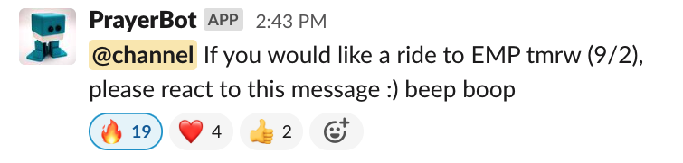
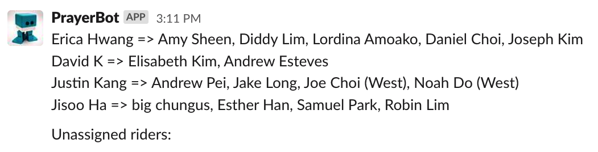
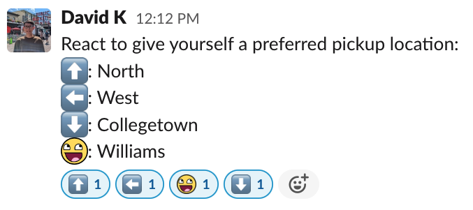

# PrayerBot (Prayer Ride Share App)

## How it works

PrayerBot is a Slack bot that resides in the [Emmaus Road
Ministry](https://emmausroadministry.slack.com) workspace. As suggested by its
name, the bot's main job is to help with organizing early morning prayer rides
for people of ER. Specifically, it pairs people with cars to people without
cars, so that anyone who wants a ride to the prayer meeting can get one.

Here's a screenshot of the bot in action:





As seen in the picture, the bot creates assignments between drivers (left) and
riders (right). The bot's algorithm takes two main factors into consideration:

1. The rider's location and the driver's location
2. The driver's car seat capacity

In its **first phase**, the bot tries to come up with an optimal driver-rider
pairing that satisfies both of the constraints. Of course, this isn't always
possible. For example, there might be too many riders, but not enough drivers
for Location 1.

However, a driver from Location 1 might have leftover seats that could be used
to seat riders from Location 2. This is the bot's **second phase**: try to generate
a suboptimal driver-rider pairing that satisfies the 2nd constraint (a
constraint that cannot be violated), while being flexible with the 1st
constraint and assigning people to the closest location with extra drivers.

The riders who are assigned to drivers from another location are distinguished
in the output message of the pairings with their location of choice in
parentheses. This ensures that the driver will know to visit the extra
location(s) to pick up the new riders.

**What if no assignment is possible?** For example, there might just be too many
riders for the number of seats that drivers have in their cars. In that case,
the algorithm recognizes that an assignment is impossible, and it shows the
assignments it tried to generate from the first two phases. The person who ran
the Slack command to run the assignments algorithm will be notified that an
assignment is impossible, but the person can manually generate a solution from
the two options to make the rides possible.

```
There’s no way to generate an optimal assignment of drivers to riders. I generated two possibilities though, feel free to modify as needed and post manually.


Option 1:
David K => David Park
Jisoo Ha => big chungus, Esther Han
Justin Kang => Andrew Pei, Sean Han, Mark Pon, Caleb Lin
Sam => Noah Do, Joe Choi

Unassigned riders: Jake Long


Option 2:
David K => David Park
Jisoo Ha => Joe Choi (West), big chungus
Justin Kang => Andrew Pei, Sean Han, Mark Pon, Caleb Lin
Sam => Jake Long (Collegetown), Noah Do

Unassigned riders: Esther Han
```

## How to use the bot

**If you need a ride:** Put your preferred pickup location by typing
`/select_ride_location [north, west, collegetown, williams]`. For example, if
you want to be picked up at Baker Flagpole on West Campus, you would type
`/select_ride_location west`. You only need to do this once! However, you still
need to like the message every day if you need a ride.

**If you are driving:** Register yourself as a driver by typing
`/become_a_driver [north, west, collegetown] [number of passenger seats]`. For
example: `/become_a_driver north 4` will make you a North driver with room for 4
more. If you want to drive the next day, you MUST react to the announcement
message, just like everyone else.

**If you don’t want to drive anymore** (e.g. no longer have a car): Just type
`/not_driving_anymore`.

## Planned features



Instead of typing out the full commands to register for locations as riders,
simply react to the appropriate post with the correct emoji. This feature uses
the Slack [Events API](https://api.slack.com/apis/connections/events-api).
